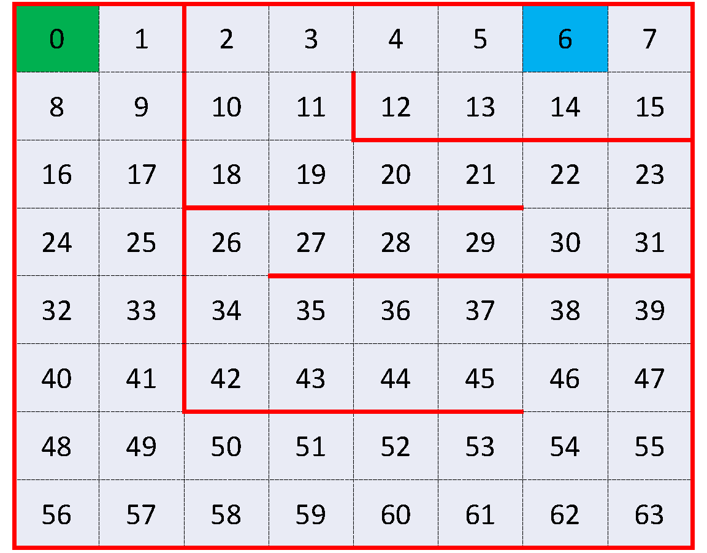
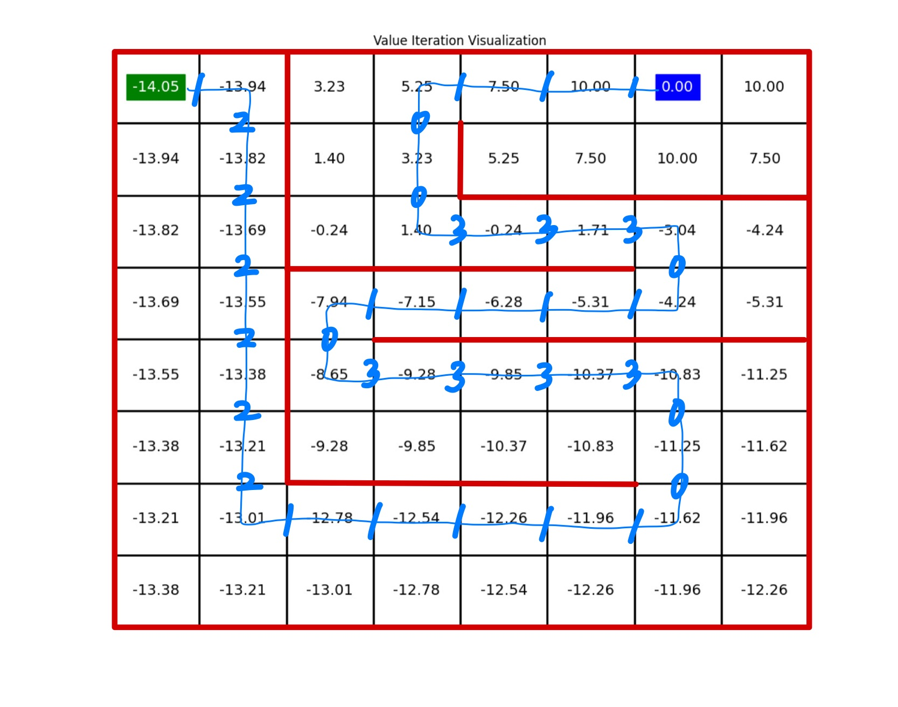

# Q Learning

## A Maze Game in Gridworld

A $8\times8$  rectangular gridworld map is shown below:



### Description

Imagine an agent moving within this $8\times 8$ gridworld, where the grids are numbered from $0$ to $63$, the red lines represent walls, and the green grid (grid $0$) and the blue grid (grid $6$) are the starting point and the destination, respectively.

The agent can move up, right, down, or left for each step except that the walls block the agent's path. That is, if there is a wall in the direction that the agent plans to move, the agent will remain in the current cell.

If the agent arrives at grid $6$ (the destination), the agent will receive a reward of $+10$ and the process will terminate. Otherwise, the agent will receive a reward of -1 with probability 0.5 and a reward of -2 with probability 0.5 for each step (including hitting the wall).

The agent's goal is to find the optimal policy that maximizes the expected discounted total reward starting from grid $0$ to grid $6$. The discount factor is $0.9$.

### Formulation

- State $s$:

    The state is defined as the grid where the agent is located. $s\in\{0,1,...,63\}$.
    The initial state is $0$ and the terminal state is $6$.

- Action $a$:
  - $a=0$: the agent plans to move *up* ⬆️;
  - $a=1$: the agent plans to move *right* ➡️;
  - $a=2$: the agent plans to move *down* ⬇️;
  - $a=3$: the agent plans to move *left* ⬅️.

- Transition:
    Examples:
  - If $s=0$ and $a=0$, then the next state will be $s'=0$ (The agent hits the wall);
  - If $s=0$ and $a=1$, then the next state will be $s'=1$;
  - If $s=0$ and $a=2$, then the next state will be $s'=8$;
  - ...

- Random reward $r(s,a)$:

    $r(5,1) = 10$, $r(7,3) = 10$, $r(14,0) = 10$. Otherwise, $r(s,a)$ is equal to $-1$ with probability $0.5$ and $-2$ with probability $0.5$.

### Q-Learning Framework

Q-learning is a model-free reinforcement learning method that allows an agent to learn the best actions to take in different states through trial and error, without needing prior knowledge. For example, teaching a robot how to navigate through a map, and the robot only have 4 steps to take, up ⬆️, right ➡️, down ⬇️, and left ⬅️.

By iteratively updating Q-values using the Bellman equation $
V_k(j) = \max_{i \in N_k(j)}(r_k(j, i) + V_{k+1}(i))$, Q-learning gradually converges to the optimal Q-function. This makes the agent to choose actions that maximize expected returns from any state.

**Update Formula**
Adjusting the Q-value towards the new estimate promises a higher return in the given state. Overtime, the action is the state will have a more rewarding action.
$$
Q(s, a) \leftarrow Q(s, a) + \beta_k [r + \alpha \max_{a'}Q(s', a') - Q(s, a)]
$$
**Temporal Difference(TD)**: The difference between the new estimate and old estimate
$$r + \alpha \max_{a'}Q(s', a') - Q(s, a)$$

- **Q-value $Q(s, a)$**: Estimated Q-value for action $u$ in state $x$

- **New Estimate $\alpha \max_{a'}Q(s', a')$**: A new estimate based on the received reward $r$ and the maximum estimated value of the next state $s'$

- **Learning Rate $\beta$**: Learning rate, determines how fast new information in Q-value updates

- **Discount Factor $\alpha$**: Weights future rewards against immediate rewards, usually sets at $0.9$

### Algorithm


1. **Initialize** Q-values arbitrarily.
2. **For each episode**:
    - Initialize state $s$.
    - **Repeat until $s$ is terminal**:
        - Select action $a$ using an $\epsilon$-greedy policy based on Q.
        - Execute action $a$, observe reward $r$, and next state $s'$.
        - Update $Q(s, a)$ based on the observed reward and the maximum Q-value of the next state.
        - Update state $s$ to $s'$.
3. **Derive optimal policy** $\pi^*$ based on the final Q-values.

### Run

```bash
python train.py
```

```bash
Your actions during the last episode:
1 2 2 2 2 2 2 1 1 1 1 1 0 0 3 3 3 3 0 1 1 1 1 0 3 3 3 0 0 1 1 1 
Your total reward averaged over 500 episodes:
-14.054
```

### Results


