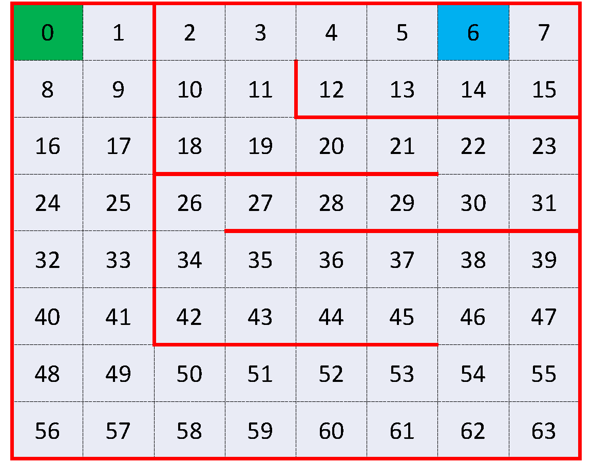

# **1**. A Maze Game in Gridworld (coding)

A $8\times8$  rectangular gridworld map is shown below:

Imagine an agent moving within this $8\times 8$ gridworld, where the grids are numbered from $0$ to $63$, the red lines represent walls, and the green grid (grid $0$) and the blue grid (grid $6$) are the starting point and the destination, respectively. The agent can move up, right, down, or left for each step except that the walls block the agent's path. That is, if there is a wall in the direction that the agent plans to move, the agent will remain in the current cell.

If the agent arrives at grid $6$ (the destination), the agent will receive a reward of $+10$ and the process will terminate. Otherwise, the agent will receive a reward of -1 with probability 0.5 and a reward of -2 with probability 0.5 for each step (including hitting the wall).

The agent's goal is to find the optimal policy that maximizes the expected discounted total reward starting from grid $0$ to grid $6$. The discount factor is $0.9$.

Formulation:

- *State $s$*:

    The state is defined as the grid where the agent is located. $s\in\{0,1,...,63\}$.
    The initial state is $0$ and the terminal state is $6$.

- *Action $a$*:

    - $a=0$: the agent plans to move *up*;
    - $a=1$: the agent plans to move *right*;
    - $a=2$: the agent plans to move *down*;
    - $a=3$: the agent plans to move *left*.

- *Transition*:
    
    Examples:
    - If $s=0$ and $a=0$, then the next state will be $s'=0$ (The agent hits the wall);
    - If $s=0$ and $a=1$, then the next state will be $s'=1$;
    - If $s=0$ and $a=2$, then the next state will be $s'=8$;
    - ...

- *Random reward $r(s,a)$*:

    $r(5,1) = 10$, $r(7,3) = 10$, $r(14,0) = 10$. Otherwise, $r(s,a)$ is equal to $-1$ with probability $0.5$ and $-2$ with probability $0.5$.

- *Objective*: Maximize the expected discounted total reward:

    $$\mathbb{E} \left[\sum_{t=0}^{\tau - 1} \alpha^t r(s_t,a_t) | s_0=0 \right]$$

  where the subscript $t$ denotes the time slot, $\tau$ is the time slot when the agent reaches the terminal state $6$ starting from $s_0$, and $\alpha=0.9$ is the discount factor.

Note that in this problem the state transition is deterministic. Define a determinitic state transition function $f$ such that $s' = f(s,a)$ where $s$ is the current state, $a$ is the current action, and $s'$ is the next state. For example, $f(0,0)=0$, $f(0,1)=1$.

Let $V^*(s)$ denote the optimal value function, defined by

$$V^*(s) = \max_{\mu} \mathbb{E} \left[\sum_{t=0}^{\tau - 1} \alpha^t r(s_t,\mu(s_t)) \vert s_0 = s \right]$$